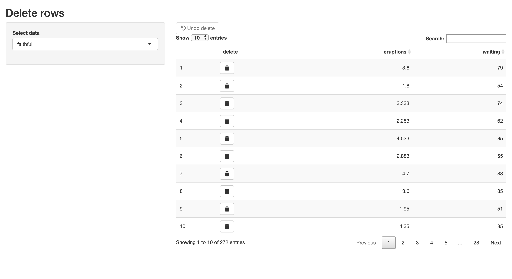

# Delete Rows from DT

Shiny example application of deleting individual rows from a [`DT::datatable`](https://rstudio.github.io/DT/shiny.html).

## [Demo Here](https://stefaneng.shinyapps.io/DeleteRowsDT/)

